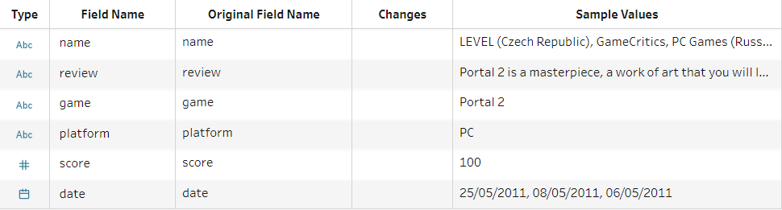

# BI-Exam

Look at Assignment 3 Integrating AI.ipynb for our solution

## Business Case Foundation

### Members

- Mohammad Hariri
- Andreas Heick

### Case ideas/domain

- Game reviews effect on game purchases
- Game reviews effect on time played
- Game data in general
- Use steamdb data for analysis

Our main idea is to look at game data, and use our Business Intelligence skills to analyze said data and gain valuable business knowledge.
The idea stems from a System Integration project we have been working on during the semester, which combines several services to make up a game review/game information platform, called gameRev. While working on this project we eyed the possibility to combine these two classes, since our work on the SI project, showed us the vast amounts of data that games contain.

#### Sources for inspiration

Here are some sources we found that discuss some of the same topics that we initially wanted to go for. We have also included a link to our other project, as it also inspired us.

- https://cs-agents.com/blog/game-review-affect-game-purchases/
- https://www.dailydot.com/parsec/metacritic-scores-game-sales-gdc-2015/
- https://github.com/hoppedyr/gameRev - our SI project

### Final business case

We have decided to look and analyze two datasets, one containing video game sales, and one containing game reviews from the Metacritic website. For this we decided to look at things like how game reviews and game sales affect eachother, and if there even is a connection. We will also look at other information these datasets provide, like genres, sales and more, as we imagine we are working as BI consultants for the game industry. Our job is to use these two datasets and get valuable business knowledge through our analysis of the data.

We will be using the Tableau tools and Python for our project.

#### Hypothesis

Our hypotheses is that games data contains valuable business knowledge, that can be used in the gaming industry. We also believe that game reviews must have some kind of effect on game sales, but to what extend we don't know yet.

## Business Data Storytelling

### [Tableau Book Link](Book-Exam.twb)

### Datasets

We have two datasets that we are using for this project, one is a video game sales dataset, that contains these fields:

- Rank - Ranking of overall sales
- Name - The games name
- Platform - Platform of the games release (i.e. PC, PS4, etc.)
- Year - Year of the game's release
- Genre - Genre of the game
- Publisher - Publisher of the game
- NA_Sales - Sales in North America (in millions)
- EU_Sales - Sales in Europe (in millions)
- JP_Sales - Sales in Japan (in millions)
- Other_Sales - Sales in the rest of the world (in millions)
- Global_Sales - Total worldwide sales.

The next dataset is the metacritic game review dataset, containing metacritics collection of professional game reviews from 2011-2019 across platforms.

- name - The review site/magazine name
- review - The review text content
- game - Name of the reviewed game
- platform - Game platform
- score - 0-100 Review score
- date - Date of the review

Here are the links to the datasets:

- https://www.kaggle.com/gregorut/videogamesales
- https://www.kaggle.com/skateddu/metacritic-critic-games-reviews-20112019

### Data Prep using Tableau Prep

We combined the datasets by integrating and preparing the data using Tableau Prep, which is an ETL tool. Using Tableau prep, we have cleaned and joined the datasets, to gain the information we want to analyze.

Here is a sample of the Video Game Sales dataset, before we cleaned it.

Here is a sample of the Metacritic Game Reviews dataset, before we cleaned it.

Here we can see Tableau Prep with what we did at each step, written in comments inside Tableau Prep.

The output from this process was a new CSV file of the combined and cleaned data, which we then imported into Tableau.

### Data Analysis

After importing the data from Tableau Prep, we made sheets and dashboards to explore and analyze the data.

#### Dashboard 1

This dashboard shows the average score of critics on the left, and on the right we see the number of reviews they have in the dataset. We have removed any below 50 reviews for accuracy. There are two figures, one showing the head and one showing the tail for comparison.

This is interesting because we can see that some critics are very positive in general, and some are very critical. We can also see that review scores are generally very high, so a score of 60, might be worth the same as a 2/10 score, it all depends on the reviewer. Maybe the reviewers have learned that people generally wants to read positive reviews? Who knows, but it could be interesting to look into.

#### Dashboard 2

This dashboard shows the top 10 games, based on global sales alone. Here we can see that Mario Kart 7 was quite popular and has sold the most copies.

#### Dashboard 3

This dashboard explores how game review scores affect the global sales. We are shown the head of the data, and we can see the global sales in millions sold, and the average review score. It is sorted descending by average score.
The first thing we notice is that there is not a clear connection between higher review score and the global sales. We can however see that there are major games and that they have sold many copies, but since we can't see more data below, we can't conclude anything from this.

#### Dashboard 4

By looking at this next dashboard, where all the data has been fitted into the dashboard, we can see a clearer trend. We can't see the game names anymore but that's not so relevant, as we want to see if the review score has any impact on sales. What we can see is that all the best selling games are in the top half, and that there are no games in the bottom half that has sold over 5 million, except one maybe.

We can also see that the best selling game isn't at the top, but it is in the top half. What we have concluded from this analysis, is that it seems like the sales decreases below a score of 80. It is hard to say why, and since we can't try releasing a terrible Mario Kart 7 with a score of 40, we can't really see if the impact is based on marketing budgets, brand exposure or something completely different. But what we now know is that it looks from the data, like score does affect sales. If you want to sell many copies of a game, then you have to put an effort into the game, and make the critics happy.

#### Dashboard 5

This next dashboard shows which game genres sells the most in EU vs NA. You might expect to see no difference, but we actually found some. It seems that american gamers likes platformers, fighting, shooter and role-playing games a bit more than europeans. Europeans however seem to prefer sports, simulation, strategy and adventure a bit more than the americans. So if you want to sell an action game, you can do it in both regions no problem. But if you want a platformer to sell well, maybe you should focus on the american audience.

## Integrating AI

Look at [Assignment 3 Integrating AI.ipynb](Assignment%203%20Integrating%20AI.ipynb) for our solution

This dashboard shows us using a python prediction algorithm, to predict a review score based on the review text. We found this interesting to look at because reviews are very different, and we wanted to see if an AI algorithm could predict if someone is positive or negative in their review. It should however be said that we can see that reviews in general are almost always closer to 100 than 0, so a negative review can also be 80, 30 or 70, it depends on the reviewer. The prediction model we have used is also not very accuracte on paper, as it sits around a 22% accuracy, but we feel it still hits quite well. We simply didn't have time to make it better, and even tried with 4 different classifiers.

We also made a countplot using python, tabpy and Tableau, and made it load data and create the plot and then show it inside Tableau.
This count plot shows which platforms the reviews in our dataset have been made on. Reviews are mainly from PS4 and PC as we can see.

## Immersive Analytics and Visualisation

### Proposal for applying innovative methods for analysis and visualisation of the implemented business data scenarios, to our BI project

 

#### Data prep in VR/MR/AR

We imagine a data preparation tool like Tableau Prep, could be done in VR/MR/AR where data preparation is instead done interactively in 3D. Joining datasets could be done with your hands, immediately showing the effects on the data. You can throw out useless features, by throwing them in the bin, and you can export the finished datasets by clicking a cloud in the top right.

When you are done, you can call up your boss mr. Tong, and show him the results in a co-op session. All he needs is to put on his VR/MR/AR headset, and he can jump right in. If he is busy, you can turn on mixed reality, and prepare your presentation by presenting to your dog.

##### Image created by Andreas Guldborg Heick

 

#### Understanding data in a new dimension

Here we imagine a 3D interactive world map where you can point or select areas or regions, and see which game genres they prefer in each world region, as you prepare your marketing campaign for your new game.

Maybe you are in a meeting with all the company bosses, and you want to show sales for each region interactively in a co-op session. The Chief Financial Officer wants to know how we are doing in Europe, so he points to that region and it reveals data for everyone else.

##### Image created by Andreas Guldborg Heick

### Benefits of applying such techniques for data analytics and visualisation in BI

Virtual Reality, Mixed Reality and Augmented Reality are all exciting technologies, the benefits we can use from them in business intelligence, are many. Business Intelligence can be complicated and data heavy, which can make it inaccessible for some less technical people, for them we can present in new ways, like an interactive globe.

From a business perspective, making data more accessible, and allowing for multiplayer sessions, where several BI developers can interact together, could be beneficial and cut time. In 2D programs it can be hard to show everything you want to, and it can be hard to share and work together, but if you share a workspace in 3D, you can see everything the other person can.

Interest in BI could also possibly be increased from school level, if we made it fun to play and work with data. Maybe children from a school class could say a game out loud, and see how many people the same age as them, play the same game all around the world.
We could also show them other similar games based on a prediction model, that takes in previously played games and the players review of them, and predicts new games for the player.
